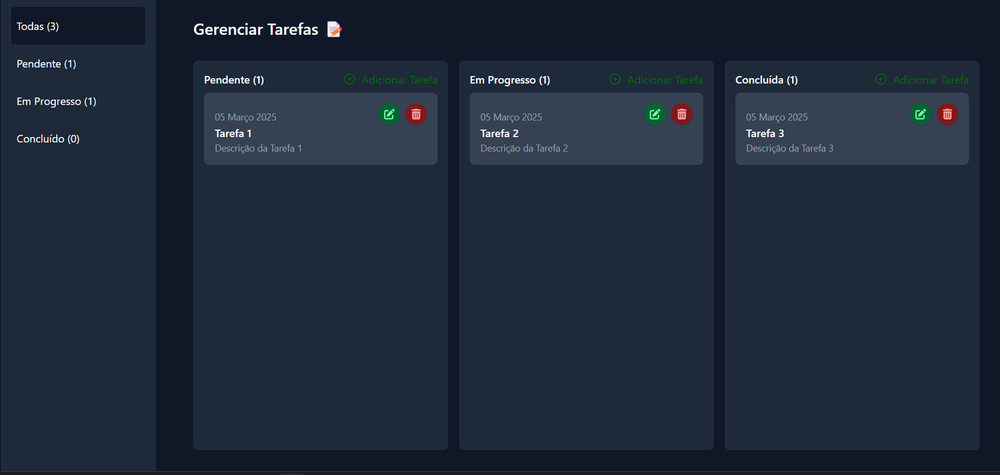

<h1>TODO (Lista de Tarefas)</h1>

Aplicativo de gerenciamento de tarefas desenvolvido com React, ASP.NET e SQL Server.



---

<h2>Configuração</h2>

Siga os passos abaixo para configurar o ambiente e executar o projeto:

1. **Clone o repositório:**
   <pre><code>git clone https://github.com/brunolexander/todo-csharp.git</code></pre>

2. **Acesse a pasta do projeto:**
   <pre><code>cd todo-csharp</code></pre>

3. **Inicie os containers com Docker:**
   <pre><code>docker-compose up -d</code></pre>

4. **Importe o banco de dados:**
   
   Copie o arquivo SQL para o container:
   ```sh
   docker container cp db/banco.sql db:/tmp/banco.sql
   ```
   
   Acesse o bash do container db:
   ```sh
   docker exec -it db bash
   ```

   Execute a importação do banco de dados:
   ```sh
   /opt/mssql-tools18/bin/sqlcmd -S localhost -U sa -P $MSSQL_SA_PASSWORD -C -i /tmp/banco.sql
   ```

Após esses passos, acesse o sistema em: <a href="http://localhost:3000">http://localhost:3000</a>

---

<h2>Testes (Opcional)</h2>

Se desejar, você pode executar os testes automatizados para validar o funcionamento do sistema.

<h6>Testes do Frontend:</h6>
<pre><code>docker exec -it frontend npm test</code></pre>

<h6>Testes do Backend:</h6>
<pre><code>docker exec -it backend dotnet test</code></pre>

---

### Dependências (Se não estiver usando Docker)

Caso não utilize Docker, é necessário instalar as seguintes dependências manualmente:

- **SQL Server 2022** - Banco de dados
- **.NET 8.0** - Backend em C#
- **Node.js 22.14** - Frontend com React
</body>
</html>
